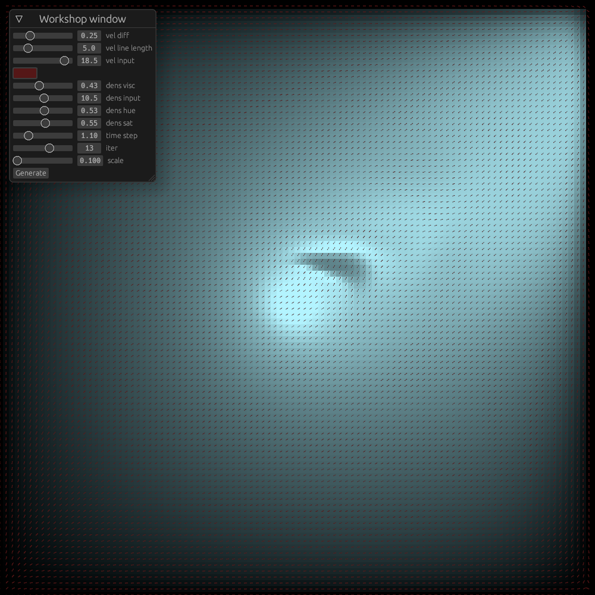
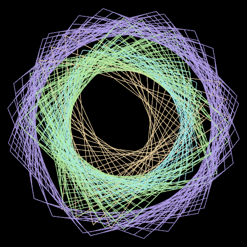
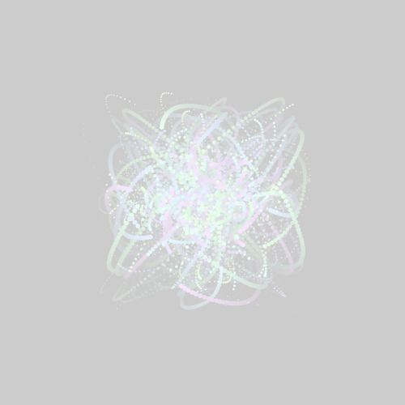
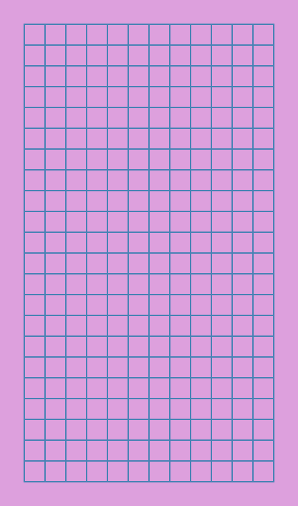
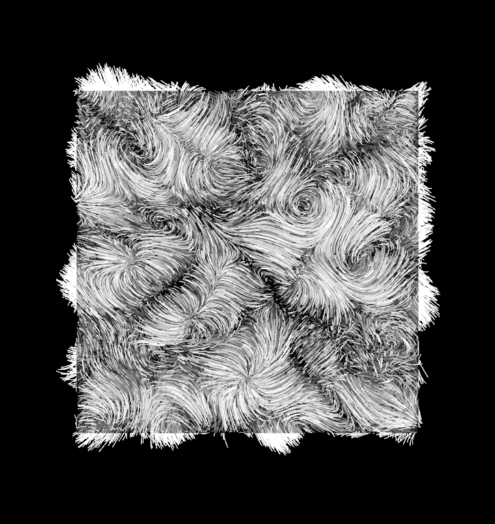

# Experiments

My creative coding mostly using [Nannou](https://nannou.cc)

## Projects

- A Renderer in Fractal flame style

  

- Boids

  

- Fluid Simulation

  

## Sketches

- d20220204

  

- schotter5

  

- d20220130

  

- d20220121

  

## Learning

- [schotter](https://github.com/sidwellr/schotter)

  

- [universe](https://www.youtube.com/watch?v=Ml6tpyTyXhM&t=776s)

  

- [Nature of code](https://natureofcode.com/)
- [Book of shaders](https://thebookofshaders.com/)
- [Generative Design](https://github.com/generative-design)
- [learn wgpu](https://sotrh.github.io/learn-wgpu/)
