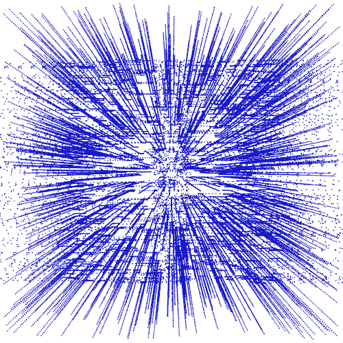
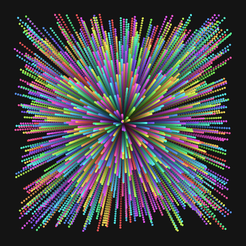
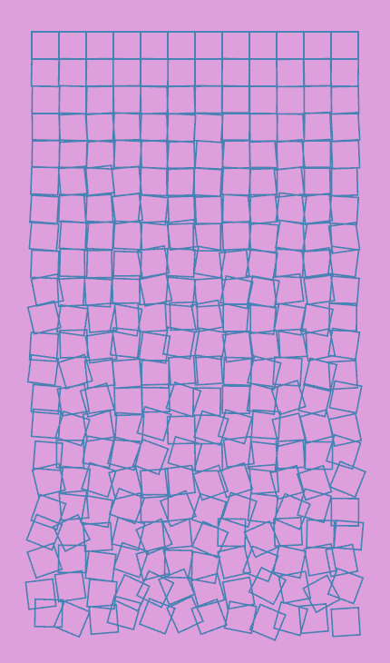
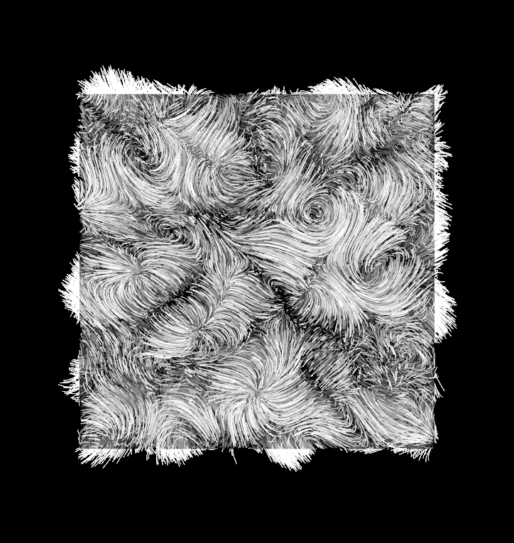
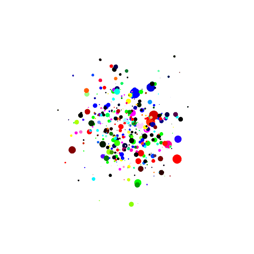
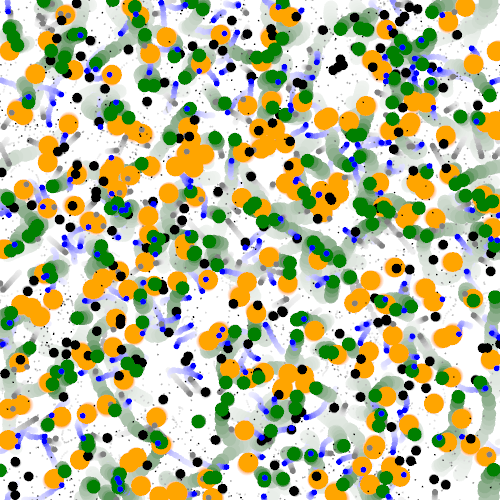

# Experiments in using [Nannou](https://nannou.cc)

## My own practice

## Tutorials

### Schotter

Copy of a piece by Georg Nees

Subtler version from schotter4

### Universe

Using <https://www.youtube.com/watch?v=Ml6tpyTyXhM&t=776s> from @Mactuitui

### Nature of code

<https://natureofcode.com>

Paint splatter.

Exosystem Project Streaks

